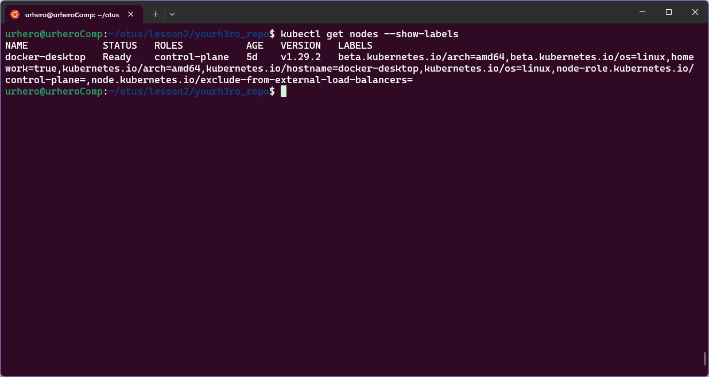
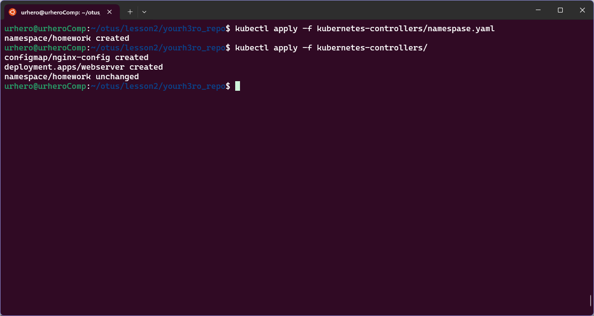
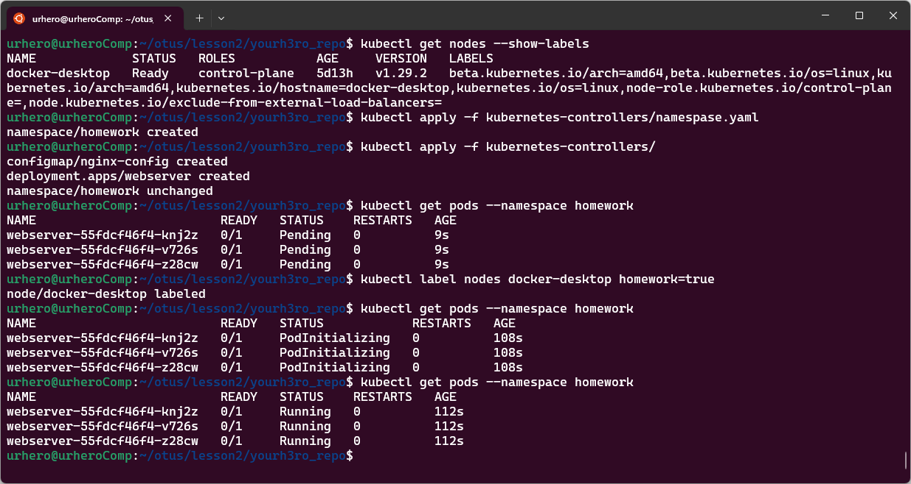
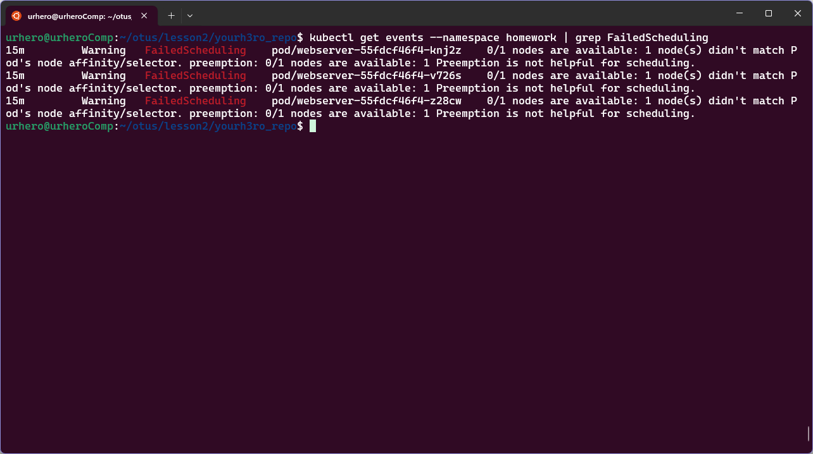
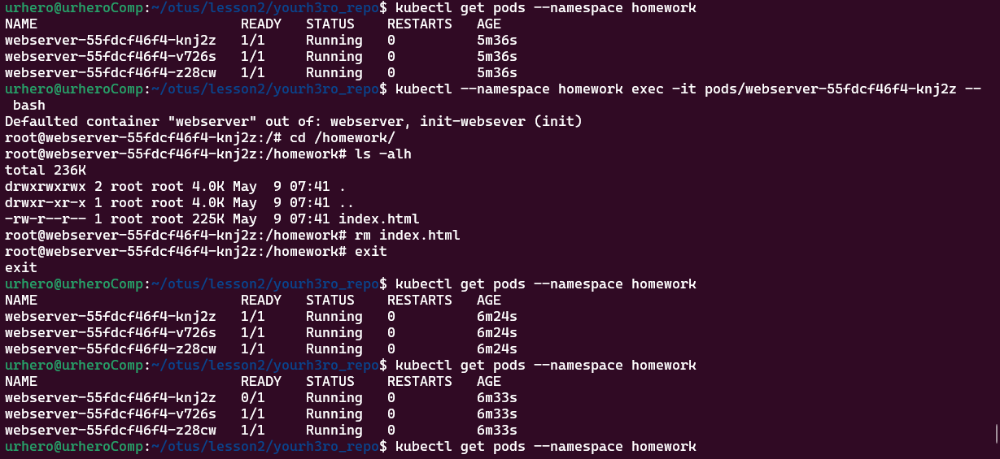
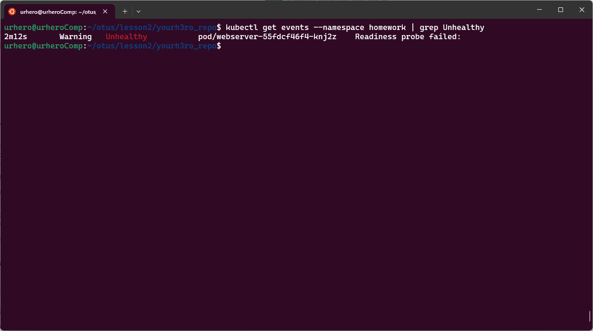
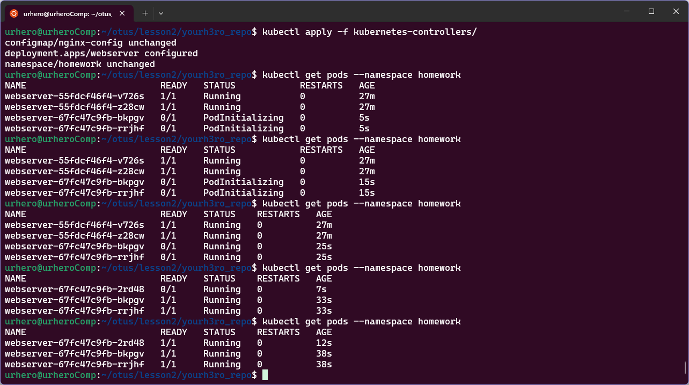

# Репозиторий для выполнения домашних заданий курса "Инфраструктурная платформа на основе Kubernetes-2024-02" 

## ДЗ#2 Kubernetes controllers. ReplicaSet, Deployment, DaemonSet  

### Задания:
- Необходимо создать манифест namespace.yaml для namespace с именем homework
- Необходимо создать манифест deployment.yaml. Он должен описывать deployment, который:
    - Будет создаваться в namespace homework
    - Запускает 3 экземпляра пода, полностью аналогичной по спецификации прошлому ДЗ.
    - В дополнение к этому будет иметь readiness пробу, проверяющую наличие файла /homework/index.html
    - Будет иметь стратегию обновления RollingUpdate, настроенную так, что в процессе обновления может быть недоступен максимум 1 под

#### Задание с *
- Добавить к манифесту deployment-а спецификацию, обеспечивающую запуск подов деплоймента, только на нодах кластера, имеющих метку homework=true

## Подготовка
1. Необходимо убедиться, что на ноде есть label `homework=true`, это можно посмотреть командой `kubectl get nodes --show-labels`. В моем случае, label уже есть на нужной ноде. Если label нет, его необходимо создать командой `kubectl label nodes <node-name> homework=true`  

  

## Запуск 
1. Создать namespace командой `kubectl apply -f kubernetes-controllers/namespase.yaml`
2. Создать остальные ресурсы командой `kubectl apply -f kubernetes-controllers/`



## Описание решения
1. За создание namespace отвечает файл `kubernetes-controllers/namespase.yaml`, который создает namespace с именем `homework`.
2. Файл `kubernetes-controllers/configmap-nginx-config.yaml` конфигурирует nginx, наследован из Д3#1
3. В файле `kubernetes-controllers/deployment.yaml`  
Создает в namespace `homework`  

```yaml
apiVersion: apps/v1
kind: Deployment
metadata:
  name: webserver
  namespace: homework
```

3 экземляра пода, под nginx из ДЗ#1

```yaml
spec:
...
  replicas: 3
```

Сконфигурирована readiness probe, которая командой `test -s /homework/index.html` проверяет наличие файла `/homework/index.html` и что файл не пуст.

```yaml
readinessProbe:
  exec:
  command:
    - sh
    - -c
    - test -s /homework/index.html
  initialDelaySeconds: 5
  periodSeconds: 5
  failureThreshold: 3
```

Сконфигурирована стратегия обновления RollingUpdate, в процессе обновления недоступен максимум 1 pod (`maxUnavailable: 1`)

```yaml
strategy:
type: RollingUpdate
rollingUpdate:
    maxSurge: 1
    maxUnavailable: 1
```

Поды запускаются только на нодах кластера, у которых есть label `homework=true`

```yaml
nodeSelector:
    homework: "true"
```

## Проверка
1. Если на нодах нет label `homework=true`, поды не запустятся. Если назначить label, pod-ы запускаются. Эти события видно через `kubectl get events --namespace homework | grep FailedScheduling`




2. Если удалить из контейнера пода `/homework/index.html`, он переидет в состояние `READY 0/1`, так как readinessProbe оканчивается ошибкой. Эти события так же видно в `kubectl get events --namespace homework | grep Unhealthy`. Для production систем необходимо сконфигурировать `restartPolicy` для подов, но здесь не сконфигурировано для наглядности:




3. Для проверки `strategy`, необходимо обновить в `deployment.yaml`, для примера я обновили image nginx с `nginx:1.25.5-bookworm` на `nginx:1.26.0-bookworm`. Поды перезапускаются по одному.

