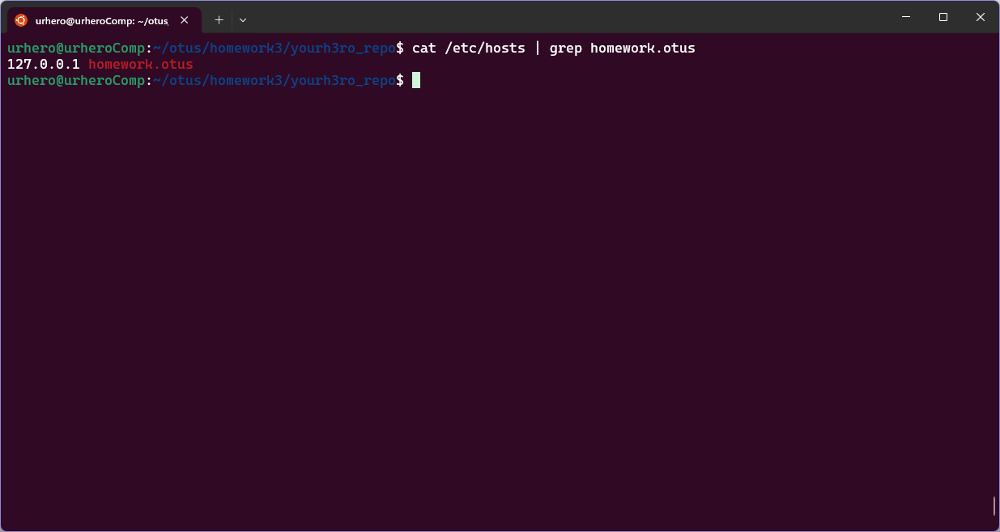
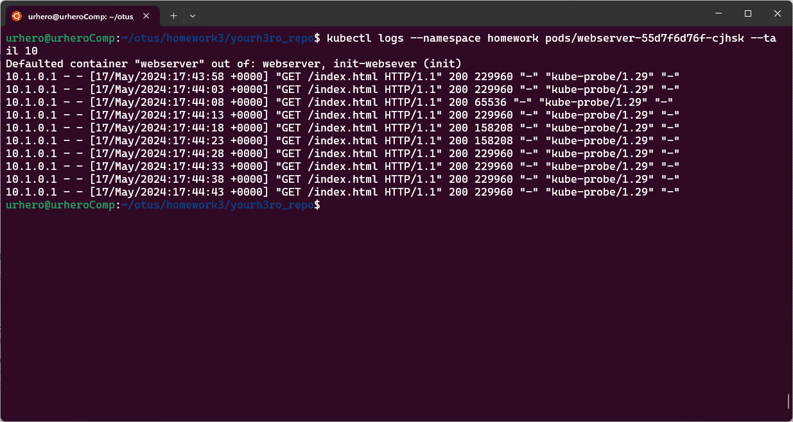
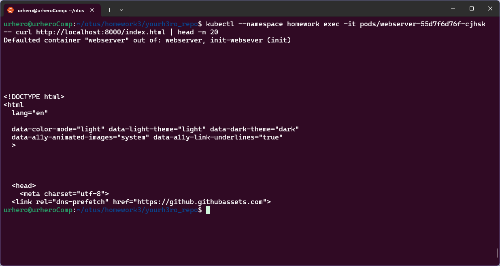
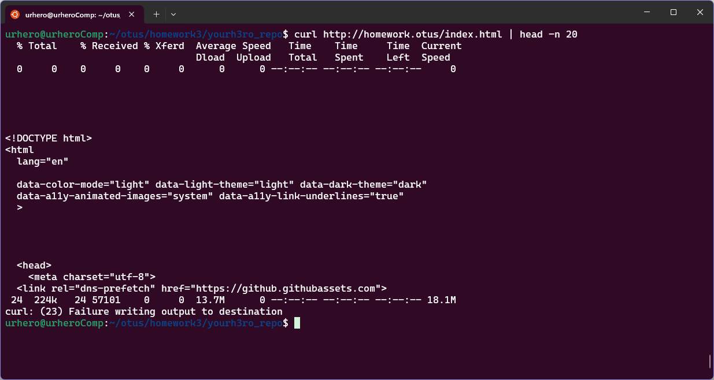

# Репозиторий для выполнения домашних заданий курса "Инфраструктурная платформа на основе Kubernetes-2024-02" 

## ДЗ#2 Kubernetes controllers. ReplicaSet, Deployment, DaemonSet  

### Задания:
- Необходимо создать манифест namespace.yaml для namespace с именем homework
- Необходимо создать манифест deployment.yaml. Он должен описывать deployment, который:
    - Будет создаваться в namespace homework
    - Запускает 3 экземпляра пода, полностью аналогичной по спецификации прошлому ДЗ.
    - В дополнение к этому будет иметь readiness пробу, проверяющую наличие файла /homework/index.html
    - Будет иметь стратегию обновления RollingUpdate, настроенную так, что в процессе обновления может быть недоступен максимум 1 под

#### Задание с *
- Добавить к манифесту deployment-а спецификацию, обеспечивающую запуск подов деплоймента, только на нодах кластера, имеющих метку homework=true

## Подготовка
1. Необходимо убедиться, что на ноде есть label `homework=true`, это можно посмотреть командой `kubectl get nodes --show-labels`. В моем случае, label уже есть на нужной ноде. Если label нет, его необходимо создать командой `kubectl label nodes <node-name> homework=true`  

  

### Запуск 
1. Создать namespace командой `kubectl apply -f kubernetes-controllers/namespase.yaml`
2. Создать остальные ресурсы командой `kubectl apply -f kubernetes-controllers/`


### Описание решения
1. За создание namespace отвечает файл `kubernetes-controllers/namespase.yaml`, который создает namespace с именем `homework`.
2. Файл `kubernetes-controllers/configmap-nginx-config.yaml` конфигурирует nginx, наследован из Д3#1
3. В файле `kubernetes-controllers/deployment.yaml`  
Создает в namespace `homework`  

```yaml
apiVersion: apps/v1
kind: Deployment
metadata:
  name: webserver
  namespace: homework
```

3 экземляра пода, под nginx из ДЗ#1

```yaml
spec:
...
  replicas: 3
```

Сконфигурирована readiness probe, которая командой `test -s /homework/index.html` проверяет наличие файла `/homework/index.html` и что файл не пуст.

```yaml
readinessProbe:
  exec:
  command:
    - sh
    - -c
    - test -s /homework/index.html
  initialDelaySeconds: 5
  periodSeconds: 5
  failureThreshold: 3
```

Сконфигурирована стратегия обновления RollingUpdate, в процессе обновления недоступен максимум 1 pod (`maxUnavailable: 1`)

```yaml
strategy:
type: RollingUpdate
rollingUpdate:
    maxSurge: 1
    maxUnavailable: 1
```

Поды запускаются только на нодах кластера, у которых есть label `homework=true`

```yaml
nodeSelector:
    homework: "true"
```

### Проверка
1. Если на нодах нет label `homework=true`, поды не запустятся. Если назначить label, pod-ы запускаются. Эти события видно через `kubectl get events --namespace homework | grep FailedScheduling`


2. Если удалить из контейнера пода `/homework/index.html`, он переидет в состояние `READY 0/1`, так как readinessProbe оканчивается ошибкой. Эти события так же видно в `kubectl get events --namespace homework | grep Unhealthy`. Для production систем необходимо сконфигурировать `restartPolicy` для подов, но здесь не сконфигурировано для наглядности:


3. Для проверки `strategy`, необходимо обновить в `deployment.yaml`, для примера я обновили image nginx с `nginx:1.25.5-bookworm` на `nginx:1.26.0-bookworm`. Поды перезапускаются по одному.


## ДЗ#3 Сетевое взаимодействие Pod, сервисы  

### Задания:
- Изменить readiness-пробу в манифесте deployment.yaml из предыдущего ДЗ на httpGet, вызывая URL /index.html.
- Необходимо создать манифест service.yaml, описывающий сервис типа ClusterIP, который будет направлять трафик на поды, управляемые вашим deployment.
- Будет создаваться в namespace homework
- Установить в кластере ingress-контроллер nginx.
- В дополнение к этому будет иметь readiness пробу, проверяющую наличие файла /homework/index.html
- Создать манифест ingress.yaml, в котором будет описан объект типа Ingress, направляющий все HTTP запросы к хосту homework.otus на ранее созданный сервис. В результате запрос http://homework.otus/index.html должен отдавать код HTML страницы, находящейся в подах.

#### Задание с *
- Доработать манифест ingress.yaml, описав в нем rewrite-правила так, чтобы обращение по адресу http://homework.otus/index.html форвардилось на http://homework.otus/homepage.

### Подготовка
1. Необходимо убедиться, что на ноде есть label `homework=true`, это можно посмотреть командой `kubectl get nodes --show-labels`. В моем случае, label уже есть на нужной ноде. Если label нет, его необходимо создать командой `kubectl label nodes <node-name> homework=true`  
2. Если, как у меня, нет dns-сервера, необходимо добавить запись в `/etc/hosts`, `127.0.0.1 homework.otus`
```sh
echo "127.0.0.1 homework.otus" | sudo tee -a /etc/hosts
```

## Запуск 
1. Создать namespace командой `kubectl apply -f kubernetes-networks/namespase.yaml`
2. Создать остальные ресурсы командой `kubectl apply -f kubernetes-networks/`


### Описание решения
1. Файлы `configmap-nginx-config.yaml`, `deployment.yaml`, `namespace.yaml` наследованы из прошлого ДЗ 
2. В `deployment.yaml` сконфиругирована readiness проба вида:
```yaml
spec:
  type: ClusterIP
  selector: 
    app: webserver
  ports:
    - name: websrv-svc-port
      protocol: TCP
      port: 8000
      targetPort: webserver-port
```
3. Файл `service.yaml` конфигурирует service с типом ClusterIP:
```yaml
# /kubernetes-networks/service.yaml
...
spec:
type: ClusterIP
selector: 
  app: webserver
ports:
  - name: websrv-svc-port
    protocol: TCP
    port: 8000
    targetPort: webserver-port
```
Имя `targetPort: webserver-port` так же определено в `deployment.yaml`, для удобства:
```yaml
# /kubernetes-networks/deployment.yaml
...
containers:
  - name: webserver
    image: nginx:1.26.0-bookworm
    ports:
      - containerPort: 8000
        name: webserver-port
```
4. В файле `ingress.yaml` сконфигурирован Ingress nginx, в кластер ingress nginx установлен по документации:  https://kubernetes.github.io/ingress-nginx/deploy/#quick-start
```sh
kubectl apply -f https://raw.githubusercontent.com/kubernetes/ingress-nginx/controller-v1.10.1/deploy/static/provider/cloud/deploy.yaml
```
```yaml
...
rules:
- host: homework.otus
  http:
    paths:
    - path: /
      pathType: Prefix
      backend:
        service:
          name: webserver-svc
          port:
            name: websrv-svc-port
```
Имя порта `name: websrv-svc-port` определено в `service.yaml` для удобства (см. п 3)

### Проверка
1. Работу readiness пробы можно проверить командой 
```sh 
kubectl logs --namespace homework pods/webserver-***-*** --tail 10
```


2. Так как service Type ClusterIP доступен только изнутри кластера, для проверки необходимо сделать exec в под и проверять "изнутри", `head -n 20` добавлено для обрезки вывода и более удобного отображения.
```sh
kubectl --namespace homework exec -it pods/webserver-55d7f6d76f-cjhsk -- curl http://localhost:8000/index.html | head -n 20
```



3. Для проверки ingress достаточно сделать (`head -n 20` так же добавлден для удобства отображения)
```sh 
curl http://homework.otus/index.html | head -n 20
```

