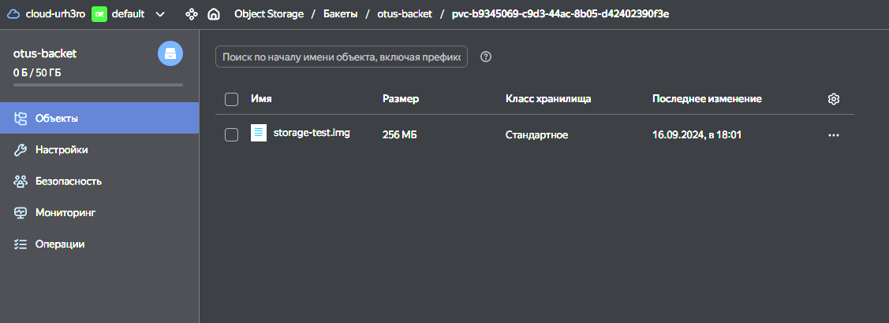

## ДЗ#12 Установка и использование CSI драйвера

### Задания:
- Данное задание будет выполняться в managed k8s в Yandex cloud
- Разверните managed Kubernetes cluster в Yandex cloud любым удобным вам способом, конфигурация нод не имеет значения
- Создайте бакет в s3 object storage Yandex cloud. Он будет использоваться для монтирования volume внутрь подов.
- Создайте ServiceAccount для доступа к бакету с правами, которые необходимы согласно инструкции YC и сгенерируйте ключи доступа.
- Создайте secret c ключами для доступа к Object Storage и приложите манифест для проверки ДЗ
- Создайте storageClass описывающий класс хранилища и приложите манифест для проверки ДЗ
- Установите CSI driver из репозитория
- Создайте манифест PVC, использующий для хранения созданный вами storageClass с механизмом autoProvisioning и приложите его для проверки ДЗ
- Создайте манифест pod или deployment, использующий созданный ранее PVC в качестве volume и монтирующий его в контейнер пода в произвольную точку монтирования и приложите манифест для проверки ДЗ.
- Под в процессе работы должен производить запись в примонтированную директорию. Убедитесь, что файлы действительно сохраняются в ObjectStorage.
### Запуск 
- Создать s3 object storage Yandex cloud, я делал это ранее в ДЗ kubernetes-logging
- Установить yc-csi `helm install --create-namespace yandex-csi-s3 ./csi-s3/`
- Установить манифесты yc-s3-secret.yaml, yc-s3-sc.yaml, yc-s3-pvc.yaml
- Запустить "Полезную нагрузку" yc-s3-test-storage-pod.yaml
### Описание решения
s3 object storage Yandex cloud и аккаунт к нему я делал еще в ДЗ kubernetes-logging, по этому я просто заново сгенерировал ключ:
```sh
urhero@urheroComp:~/otus/homework12/yourh3ro_repo$ yc iam access-key create --service-account-name bucket-acc
access_key:
  id: ajeh6rd4bj4sdbeq55j9
  service_account_id: ajeka3kirg39l24ouqf7
  created_at: "2024-09-16T14:37:57.423849035Z"
  key_id: YCAJEEk4qXN_sO0yM5WJ-YlGJ
secret: YCN_rF2gbEDttu3qhgkPBC_BolC********
```
Далее по интрукции установил helm chart https://github.com/yandex-cloud/k8s-csi-s3  
И создал необходимые ресурсы:  
```yaml
# yc-s3-secret.yaml
apiVersion: v1
kind: Secret
metadata:
  name: csi-s3-secret
  namespace: kube-system
stringData:
  accessKeyID: YCAJEEk4qXN_sO0yM5WJ-YlGJ
  secretAccessKey: YCN_rF2gbEDttu3qhgkPBC_BolC********
  endpoint: https://storage.yandexcloud.net
---
# yc-s3-sc.yaml
kind: StorageClass
apiVersion: storage.k8s.io/v1
metadata:
  name: csi-s3-existing-bucket
provisioner: ru.yandex.s3.csi
parameters:
  mounter: geesefs
  options: "--memory-limit 1000 --dir-mode 0777 --file-mode 0666"
  bucket: otus-backet
  csi.storage.k8s.io/provisioner-secret-name: csi-s3-secret
  csi.storage.k8s.io/provisioner-secret-namespace: kube-system
  csi.storage.k8s.io/controller-publish-secret-name: csi-s3-secret
  csi.storage.k8s.io/controller-publish-secret-namespace: kube-system
  csi.storage.k8s.io/node-stage-secret-name: csi-s3-secret
  csi.storage.k8s.io/node-stage-secret-namespace: kube-system
  csi.storage.k8s.io/node-publish-secret-name: csi-s3-secret
  csi.storage.k8s.io/node-publish-secret-namespace: kube-system
volumeBindingMode: Immediate
---
# yc-s3-pvc.yml
apiVersion: v1
kind: PersistentVolumeClaim
metadata:
  name: csi-s3-pvc
  namespace: default
spec:
  accessModes:
  - ReadWriteMany
  resources:
    requests:
      storage: 5Gi
  storageClassName: csi-s3-existing-bucket
```
После применения этих манифетов я смог создать вод с "полезной" нагрузкой, в который подмонтировал yc s3:
```yaml
apiVersion: v1
kind: Pod
metadata:
  name: yc-s3-test-storage-pod
  namespace: default
spec:
  containers:
    - name: yc-s3-test-storage-pod
      image: busybox:1.31.1
      command: [ "sh", "-c", "dd if=/dev/zero of=/data/storage-test.img bs=1M count=256 && sleep 3600" ]
      volumeMounts:
        - name: data
          mountPath: /data
  volumes:
    - name: data
      persistentVolumeClaim:
        claimName: csi-s3-pvc
        readOnly: false
```
И увидел в консоли yandex cloud созданный файл:  
