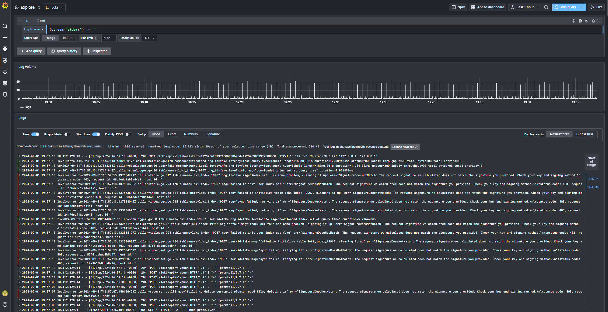

## ДЗ#9 Сервисы централизованного логирования для Kubernetes

### Задания:
- Данное задание будет выполняться в managed k8s в Yandex cloud.
- Разверните managed Kubernetes кластер в Yandex cloud любым удобным вам способом.
- Для кластера создайте два пула нод:
  - Для рабочей нагрузки (можно 1 ноду).
  - Для инфраструктурных сервисов (также хватит пока и одной ноды).
- Для инфраструктурной ноды/нод добавьте taint, запрещающий на неё планирование подов с посторонней нагрузкой - node-role=infra:NoSchedule.
- Приложите к ДЗ вывод команд kubectl get node -o wide --show-labels и kubectl get nodes -o custom-columns=NAME:.metadata.name,TAINTS:.spec.taints показывающий конфигурацию нод в вашем кластере.
- Создайте бакет в S3 object storage Yandex cloud. В нём будут храниться логи, собираемые Loki. Также необходимо будет создать ServiceAccount для доступа к бакету и сгенерировать ключи доступа согласно инструкции YC.
- Установите в кластер Loki:
  - Монолитный или распределённый режим не принципиально.
  - Необходимо сконфигурировать параметры установки так, чтобы компонент Loki устанавливался исключительно на infra-ноду (добавьте соответствующий toleration для обхода taint, а также nodeSelector или nodeAffinity на ваш выбор, для планирования подов только на заданные ноды).
  - Место хранения логов – S3 бакет, ранее сконфигурированный вами.
  - auth_enabled: false.
- Установите в кластер Promtail:
- Агент Promtail должен быть развернут на всех нодах кластера, включая infra-ноду (добавьте toleration).
- Установите в кластер Grafana:
  - Она должна быть установлена на infra-ноду (toleration и nodeSelector/NodeAffinity).
  - Для установленных Loki, Promtail и Grafana приложите к ДЗ файл values.yaml, который вы использовали для установки, а также команду установки и репозиторий, из которого ставили, если требуется. Не обязательно устанавливать все 3 компонента из разных чартов, приложите именно тот способ установки, который вы использовали.
  - В Grafana необходимо настроить data source к Loki и сделать explore по этому datasource и убедиться, что логи отображаются. Приложите скриншот этого экрана из Grafana.
  - Если будете ставить Loki из чарта, который предлагает Yandex (там достаточно старый Loki) – последние версии Grafana могут не заработать с ним, необходимо будет явно установить какую-то из старых версий (например 8.5.28).

### Запуск 
- Создать в yc необходимые ресурсы согласно описанию
- Добавить в helm репозитории grafana/grafana
- helm install loki --create-namespace ./loki
- helm install grafana --create-namespace ./grafana

### Описание решения
#### Приложите к ДЗ вывод команд kubectl get node -o wide --show-labels и kubectl get nodes -o custom-columns=NAME:.metadata.name,TAINTS:.spec.taints показывающий конфигурацию нод в вашем кластере.

Я не знаю, правильно или нет, но, хоть в задании этого прямо и не сказано, но я сделал label для infra-nod-ы:
```sh
kubectl label nodes cl1mch556oeg73hkva5l-adoq node-role=infra
```
```sh
urhero@urheroComp:~/otus/homework9/yourh3ro_repo$ kubectl get node -o wide --show-labels
NAME                        STATUS   ROLES    AGE     VERSION   INTERNAL-IP   EXTERNAL-IP      OS-IMAGE             KERNEL-VERSION      CONTAINER-RUNTIME     LABELS
cl1mch556oeg73hkva5l-adoq   Ready    <none>   4m36s   v1.29.1   10.129.0.27   89.169.161.205   Ubuntu 20.04.6 LTS   5.4.0-177-generic   containerd://1.6.28   beta.kubernetes.io/arch=amd64,beta.kubernetes.io/instance-type=standard-v3,beta.kubernetes.io/os=linux,failure-domain.beta.kubernetes.io/zone=ru-central1-b,kubernetes.io/arch=amd64,kubernetes.io/hostname=cl1mch556oeg73hkva5l-adoq,kubernetes.io/os=linux,node.kubernetes.io/instance-type=standard-v3,node.kubernetes.io/kube-proxy-ds-ready=true,node.kubernetes.io/masq-agent-ds-ready=true,node.kubernetes.io/node-problem-detector-ds-ready=true,topology.kubernetes.io/zone=ru-central1-b,yandex.cloud/node-group-id=cat0v93m5blvhi54rqgo,yandex.cloud/pci-topology=k8s,yandex.cloud/preemptible=false
cl1tj6gu3bs2u720c45l-ataw   Ready    <none>   5m25s   v1.29.1   10.129.0.15   51.250.111.217   Ubuntu 20.04.6 LTS   5.4.0-177-generic   containerd://1.6.28   beta.kubernetes.io/arch=amd64,beta.kubernetes.io/instance-type=standard-v3,beta.kubernetes.io/os=linux,failure-domain.beta.kubernetes.io/zone=ru-central1-b,kubernetes.io/arch=amd64,kubernetes.io/hostname=cl1tj6gu3bs2u720c45l-ataw,kubernetes.io/os=linux,node.kubernetes.io/instance-type=standard-v3,node.kubernetes.io/kube-proxy-ds-ready=true,node.kubernetes.io/masq-agent-ds-ready=true,node.kubernetes.io/node-problem-detector-ds-ready=true,topology.kubernetes.io/zone=ru-central1-b,yandex.cloud/node-group-id=catvrk52e745dob6mor7,yandex.cloud/pci-topology=k8s,yandex.cloud/preemptible=false
```

```sh
urhero@urheroComp:~/otus/homework9/yourh3ro_repo/kubernetes-logging$ kubectl get nodes -o custom-columns=NAME:.metadata.name,TAINTS:.spec.taints
NAME                        TAINTS
cl1mch556oeg73hkva5l-adoq   [map[effect:NoSchedule key:node-role value:infra]]
cl1tj6gu3bs2u720c45l-ataw   <none>
urhero@urheroComp:~/otus/homework9/yourh3ro_repo/kubernetes-logging$ kubectl get node -o wide --show-labels
NAME                        STATUS   ROLES    AGE   VERSION   INTERNAL-IP   EXTERNAL-IP      OS-IMAGE             KERNEL-VERSION      CONTAINER-RUNTIME     LABELS
cl1mch556oeg73hkva5l-adoq   Ready    <none>   31h   v1.29.1   10.129.0.27   51.250.19.145    Ubuntu 20.04.6 LTS   5.4.0-177-generic   containerd://1.6.28   beta.kubernetes.io/arch=amd64,beta.kubernetes.io/instance-type=standard-v3,beta.kubernetes.io/os=linux,failure-domain.beta.kubernetes.io/zone=ru-central1-b,kubernetes.io/arch=amd64,kubernetes.io/hostname=cl1mch556oeg73hkva5l-adoq,kubernetes.io/os=linux,node-role=infra,node.kubernetes.io/instance-type=standard-v3,node.kubernetes.io/kube-proxy-ds-ready=true,node.kubernetes.io/masq-agent-ds-ready=true,node.kubernetes.io/node-problem-detector-ds-ready=true,topology.kubernetes.io/zone=ru-central1-b,yandex.cloud/node-group-id=cat0v93m5blvhi54rqgo,yandex.cloud/pci-topology=k8s,yandex.cloud/preemptible=false
cl1tj6gu3bs2u720c45l-ataw   Ready    <none>   31h   v1.29.1   10.129.0.15   89.169.172.195   Ubuntu 20.04.6 LTS   5.4.0-177-generic   containerd://1.6.28   beta.kubernetes.io/arch=amd64,beta.kubernetes.io/instance-type=standard-v3,beta.kubernetes.io/os=linux,failure-domain.beta.kubernetes.io/zone=ru-central1-b,kubernetes.io/arch=amd64,kubernetes.io/hostname=cl1tj6gu3bs2u720c45l-ataw,kubernetes.io/os=linux,node.kubernetes.io/instance-type=standard-v3,node.kubernetes.io/kube-proxy-ds-ready=true,node.kubernetes.io/masq-agent-ds-ready=true,node.kubernetes.io/node-problem-detector-ds-ready=true,topology.kubernetes.io/zone=ru-central1-b,yandex.cloud/node-group-id=catvrk52e745dob6mor7,yandex.cloud/pci-topology=k8s,yandex.cloud/preemptible=false
```
#### Cоздайте бакет в S3 object storage Yandex cloud.
#### Установите в кластер Loki
Loki ставил по иснтрукции из документации yandex cloud:  
https://yandex.cloud/ru/docs/managed-kubernetes/operations/applications/loki  
Promtail уже есть "в комплекте" чарта  
Соответственно, я прописа соответсвующие анстройки starage и tolaration и nodeSelector-ы:
```yml
...
        storageConfig:
            boltdb_shipper:
                shared_store: s3
                active_index_directory: /var/loki/index
                cache_location: /var/loki/cache
                cache_ttl: 168h
            aws:
                endpoint: storage.yandexcloud.net
                region: ru-central1
                bucketnames: otus-backet
...
loki-distributed:
    serviceaccountawskeyvalue: string
    serviceaccountawskeyvalue_generated:
        accessKeyID: ajeka3kirg39l24ouqf7
        secretAccessKey: YCNIHYZdCZZbB9cmefN5GYTbeziAES_BmKtWWZzT
...
# Для promtail настраиваю планирование на все ноды кластера
promtail:
    nodeSelector: {}
    tolerations:
...
        - key: node-role
            operator: Equal
            value: infra
            effect: NoSchedule

# Для остальных сервисов только на infra ноды:
    loki: # так же ingester и другие...
    ...
        # -- Node selector for loki pods
        nodeSelector: 
          node-role: infra
        # -- Tolerations for oki pods
        tolerations: 
          - key: node-role
            operator: Equal
            value: infra
            effect: NoSchedule
```
Результат (cl1mch556oeg73hkva5l-adoq является infra нодой):
```sh
helm install \
  --namespace loki \
  --create-namespace \
  loki ./loki/
```
```sh
urhero@urheroComp:~/otus/homework9/yourh3ro_repo/kubernetes-logging$ kubectl get pod -o=custom-columns=NAME:.metadata.name,STATUS:.status.phase,NODE:.spec.nodeName -n loki
NAME                                                    STATUS    NODE
loki-loki-distributed-distributor-64bfcf7cc4-cvtnz      Running   cl1mch556oeg73hkva5l-adoq
loki-loki-distributed-gateway-5f5db84d84-djq79          Running   cl1mch556oeg73hkva5l-adoq
loki-loki-distributed-ingester-0                        Running   cl1mch556oeg73hkva5l-adoq
loki-loki-distributed-querier-0                         Running   cl1mch556oeg73hkva5l-adoq
loki-loki-distributed-query-frontend-5bb7f455dd-6qljb   Running   cl1mch556oeg73hkva5l-adoq
loki-promtail-dg66v                                     Running   cl1tj6gu3bs2u720c45l-ataw
loki-promtail-l5495                                     Running   cl1mch556oeg73hkva5l-adoq
```
#### Установите в кластер Grafana
Для Grafana я взял репозиторий чартов grafana:  
Документация https://grafana.com/docs/grafana/latest/setup-grafana/installation/helm/  
```sh
helm repo add grafana https://grafana.github.io/helm-charts
helm pull grafana/grafana
``` 
Изменил в values.yaml параметры необходимые для выполнения задания:
```yaml
# Для планирования на infra nod-ы
...
nodeSelector: 
  node-role: infra
tolerations: 
  - key: node-role
    operator: Equal
    value: infra
    effect: NoSchedule
...
# Так же нужно задеплоить не latest, а версию старше, я взял 8.5.27, так как испльзую старый loki 
image:
  # -- The Docker registry
  registry: docker.io
  # -- Docker image repository
  repository: grafana/grafana
  # Overrides the Grafana image tag whose default is the chart appVersion
  tag: "8.5.27"
```
Далее в Data Source подключил Loki по dns имени loki-gateway внутри кластера и получил логи:  

