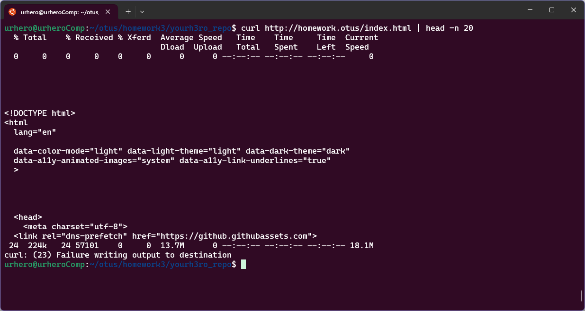

## ДЗ#3 Сетевое взаимодействие Pod, сервисы  

### Задания:
- Изменить readiness-пробу в манифесте deployment.yaml из предыдущего ДЗ на httpGet, вызывая URL /index.html.
- Необходимо создать манифест service.yaml, описывающий сервис типа ClusterIP, который будет направлять трафик на поды, управляемые вашим deployment.
- Будет создаваться в namespace homework
- Установить в кластере ingress-контроллер nginx.
- В дополнение к этому будет иметь readiness пробу, проверяющую наличие файла /homework/index.html
- Создать манифест ingress.yaml, в котором будет описан объект типа Ingress, направляющий все HTTP запросы к хосту homework.otus на ранее созданный сервис. В результате запрос http://homework.otus/index.html должен отдавать код HTML страницы, находящейся в подах.

#### Задание с *
- Доработать манифест ingress.yaml, описав в нем rewrite-правила так, чтобы обращение по адресу http://homework.otus/index.html форвардилось на http://homework.otus/homepage.

### Подготовка
1. Необходимо убедиться, что на ноде есть label `homework=true`, это можно посмотреть командой `kubectl get nodes --show-labels`. В моем случае, label уже есть на нужной ноде. Если label нет, его необходимо создать командой `kubectl label nodes <node-name> homework=true`  
2. Если, как у меня, нет dns-сервера, необходимо добавить запись в `/etc/hosts`, `127.0.0.1 homework.otus`
```sh
echo "127.0.0.1 homework.otus" | sudo tee -a /etc/hosts
```


### Запуск 
1. Создать namespace командой `kubectl apply -f kubernetes-networks/namespase.yaml`
2. Создать остальные ресурсы командой `kubectl apply -f kubernetes-networks/`


### Описание решения
1. Файлы `configmap-nginx-config.yaml`, `deployment.yaml`, `namespace.yaml` наследованы из прошлого ДЗ 
2. В `deployment.yaml` сконфиругирована readiness проба вида:
```yaml
spec:
  type: ClusterIP
  selector: 
    app: webserver
  ports:
    - name: websrv-svc-port
      protocol: TCP
      port: 8000
      targetPort: webserver-port
```
3. Файл `service.yaml` конфигурирует service с типом ClusterIP:
```yaml
# /kubernetes-networks/service.yaml
...
spec:
type: ClusterIP
selector: 
  app: webserver
ports:
  - name: websrv-svc-port
    protocol: TCP
    port: 8000
    targetPort: webserver-port
```
Имя `targetPort: webserver-port` так же определено в `deployment.yaml`, для удобства:
```yaml
# /kubernetes-networks/deployment.yaml
...
containers:
  - name: webserver
    image: nginx:1.26.0-bookworm
    ports:
      - containerPort: 8000
        name: webserver-port
```
4. В файле `ingress.yaml` сконфигурирован Ingress nginx, в кластер ingress nginx установлен по документации:  https://kubernetes.github.io/ingress-nginx/deploy/#quick-start
```sh
kubectl apply -f https://raw.githubusercontent.com/kubernetes/ingress-nginx/controller-v1.10.1/deploy/static/provider/cloud/deploy.yaml
```
```yaml
...
rules:
- host: homework.otus
  http:
    paths:
    - path: /
      pathType: Prefix
      backend:
        service:
          name: webserver-svc
          port:
            name: websrv-svc-port
```
Имя порта `name: websrv-svc-port` определено в `service.yaml` для удобства (см. п 3)

### Проверка
1. Работу readiness пробы можно проверить командой 
```sh 
kubectl logs --namespace homework pods/webserver-***-*** --tail 10
```


2. Так как service Type ClusterIP доступен только изнутри кластера, для проверки необходимо сделать exec в под и проверять "изнутри", `head -n 20` добавлено для обрезки вывода и более удобного отображения.
```sh
kubectl --namespace homework exec -it pods/webserver-55d7f6d76f-cjhsk -- curl http://localhost:8000/index.html | head -n 20
```


3. Для проверки ingress достаточно сделать (`head -n 20` так же добавлден для удобства отображения)
```sh 
curl http://homework.otus/index.html | head -n 20
```

