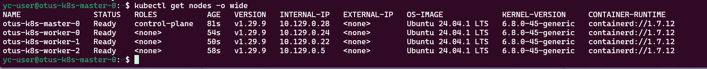
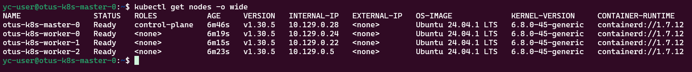
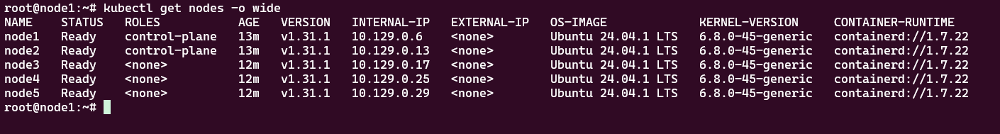

## ДЗ#13 Диагностика и отладка в Kubernetes

### Задания:
Для выполнения данного задания вам потребуется создать минимум 4 виртуальных машины в YC следующей конфигурации:
- Для master: 1 узел, 2 vCPU, 8 GB RAM.
- Для worker: 3 узла, 2 vCPU, 8 GB RAM.
- Версия создаваемого кластера должна быть на одну ниже актуальной версии Kubernetes на момент выполнения (т.е. если последняя актуальная версия 1.30.x, то устанавливайте 1.29.x).
- Выполните подготовительные работы на узлах в соответствии с инструкцией (отключите swap, включите маршрутизацию и т.д.).
- Установите containerd, kubeadm, kubelet, kubectl на все ВМ.
- Выполните kubeadm init на мастер-ноде.
- Установите Flannel в качестве сетевого плагина.
- Выполните kubeadm join на воркер-нодах.
- Приложите к результатам ДЗ вывод команды kubectl get nodes -o wide, показывающий статус и версию k8s всех узлов кластера.
- Приложите к результатам ДЗ все команды, выполненные вами как на мастер-ноде, так и на воркер-нодах (можно в README, можно в виде .sh скриптов или иным удобным вам способом) для возможности воспроизведения ваших действий.
- Выполните обновление мастер-ноды до последней актуальной версии k8s с помощью kubeadm.
- Последовательно выведите из эксплуатации все воркер-ноды, обновите их до последней актуальной версии и верните в эксплуатацию.
- Приложите к результатам ДЗ все команды по обновлению версии кластера, аналогично тому, как вы делали это для команд установки.
- Приложите к результатам ДЗ вывод команды kubectl get nodes -o wide, показывающий статус и версию k8s всех узлов кластера после обновления.

#### Задание со *
Создайте минимум 5 узлов следующей конфигурации:
- Для master: 3 узла, 2 vCPU, 8 GB RAM.
- Для worker: минимум 2 узла, 2 vCPU, 8 GB RAM.
- Разверните отказоустойчивый кластер K8s с помощью kubespray (3 master узла, минимум 2 worker).
- К результатам ДЗ приложите inventory файл, который вы использовали для создания кластера, и вывод команды kubectl get nodes -o wide.

### Описание решения
Для установки k8s кластера был создан ряд скриптов:
```sh
.
├── README.md
├── createCluster.sh # Создание кластера k8s 
├── createVms.sh     # Создание вирутальных машин с помощью утилиты yc
├── flannel.yaml     # Конфигурация для установки flannel
├── kubeadm_join.cmd # Временный файл создаваемый скриптом createCluster, нужен для добавления worker-ов в кластер
├── prepareVms.sh    # Подготовка виртуальных машин и установка зависимостей
├── removeVms.sh     # Удалить все виртуальные машины. Нужен был для отладки  
└── updateCluster.sh # Обновить кластер
```
Запускать в таком порядке:
```sh 
# Создание ВМ 
# Ждем пока машины создадутся...
# Смотрю через watch yc compute instance list, пока у всех ВМ не будет статус RUNNING + еще около минуты на окончательную инициализацию
./createVms.sh

# Подготовка, установка зависимостей
./prepareVms.sh

# Установка кластера (v. 1.29.9)
./createCluster.sh
```

```sh
# Обновление кластера
./updateCluster.sh
```



##### Задание со *
Сначала нужно создать виртуальные машины с помощью скрипта 
```sh 
# Создание ВМ 
# Ждем пока машины создадутся...
# Смотрю через watch yc compute instance list, пока у всех ВМ не будет статус RUNNING + еще около минуты на окончательную инициализацию
./kubespray/createVms.sh
```
Подготовка:
```sh
# Клонируем репо и переходим в каталог
git clone https://github.com/kubernetes-sigs/kubespray.git
cd kubespray

# Ansible у меня уже был установлен, при необходимости надо установить ansible и зависимости самой роли
ansbile --version # [2.16.11]
pip3 install -r requirements.txt
```

Далее, нужно сделать checkout на нужный релиз и выполнить команды:
```sh
git checkout ${RELEASE_BRANCH}

declare -a IPS=($(yc compute instance list --format=json | jq -r '.[] | select(.name | startswith("otus-k8s-")) | .network_interfaces[0].primary_v4_address.one_to_one_nat.address'))
CONFIG_FILE=inventory/mycluster/hosts.yaml python3 contrib/inventory_builder/inventory.py ${IPS[@]}
ansible-playbook -i inventory/mycluster/hosts.yaml --become --become-user=root cluster.yml
```
Но, у меня:
1. Последний на данный момент релиз (release-2.26) не заработал. Роль падала на этапе проверки работы etcd. В ветке master это пофиксили, по этому я использовал master (commit/6b3eaf8312892f29808d69575e457a05fdb92b6b)
2. hosts.yaml файл сформированный через команду для меня работал неккоректно. Пришлось "доработать напильником":
  - Заменил `access_ip` и `ip` на INTERNAL IP из вывода `yc compute instance list`
  - Добавил `ansible_user: yc-user`
```sh
urhero@urheroComp:~/otus/homework14/yourh3ro_repo/kubernetes-prod/kubespray/kubespray$ yc compute instance list
+----------------------+-------------------+---------------+---------+----------------+-------------+
|          ID          |       NAME        |    ZONE ID    | STATUS  |  EXTERNAL IP   | INTERNAL IP |
+----------------------+-------------------+---------------+---------+----------------+-------------+
| epd075ioed94jvnlbboc | otus-k8s-master-1 | ru-central1-b | RUNNING | 158.160.8.190  | 10.129.0.6  |
| epd0arb27lp68rcd1hdv | otus-k8s-master-0 | ru-central1-b | RUNNING | 158.160.6.7    | 10.129.0.13 |
| epd1t449go0on4gramq8 | otus-k8s-worker-2 | ru-central1-b | RUNNING | 158.160.1.186  | 10.129.0.17 |
| epdrhk24p7d3r0297jmc | otus-k8s-worker-0 | ru-central1-b | RUNNING | 158.160.29.116 | 10.129.0.25 |
| epdvbk05ke6ir7mc4ej0 | otus-k8s-worker-1 | ru-central1-b | RUNNING | 158.160.6.215  | 10.129.0.29 |
+----------------------+-------------------+---------------+---------+----------------+-------------+
```
```yaml
all:
  hosts:
    node1:
      ansible_host: 158.160.8.190
      ip: 10.129.0.6
      access_ip: 10.129.0.6
      ansible_user: yc-user
    node2:
      ansible_host: 158.160.6.7
      ip: 10.129.0.13
      access_ip: 10.129.0.13
      ansible_user: yc-user
    node3:
      ansible_host: 158.160.1.186
      ip: 10.129.0.17
      access_ip: 10.129.0.17
      ansible_user: yc-user
    node4:
      ansible_host: 158.160.29.116
      ip: 10.129.0.25
      access_ip: 10.129.0.25
      ansible_user: yc-user
    node5:
      ansible_host: 158.160.6.215
      ip: 10.129.0.29
      access_ip: 10.129.0.29
      ansible_user: yc-user
  children:
    kube_control_plane:
      hosts:
        node1:
        node2:
    kube_node:
      hosts:
        node1:
        node2:
        node3:
        node4:
        node5:
    etcd:
      hosts:
        node1:
        node2:
        node3:
    k8s_cluster:
      children:
        kube_control_plane:
        kube_node:
    calico_rr:
      hosts: {}
```

Результат выполнения роли:

