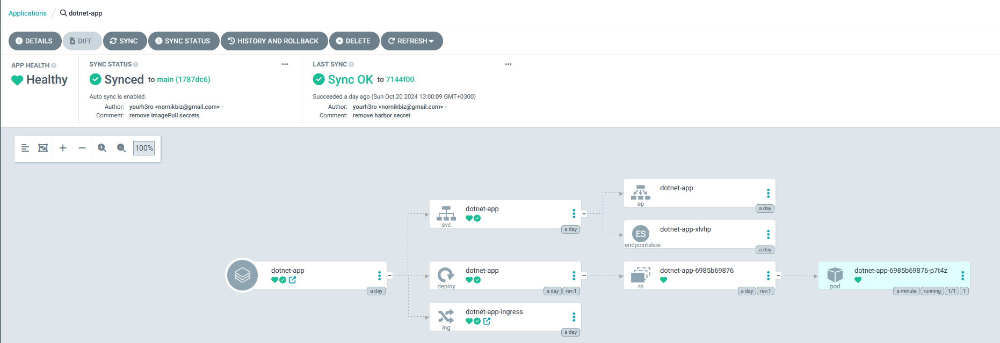
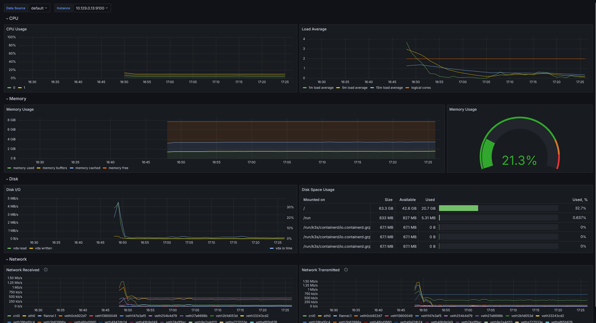

# MVP приложение
## Описание решения
Данный проект направлен на создание и настройку кластера k3s с использованием различных инструментов и компонентов для управления и мониторинга приложений. Проект включает в себя установку инструментов CI/CD, мониторинга и администрирования, а также создание необходимых конфигураций для обеспечения их работы.

### K3s
```
├── k3s-install         
│   ├── createVms.sh   # Скрипт для создания виртуальных машин в Yandex Cloud
│   ├── export.txt      # Вспомоглательный файл, просто храню команду для экспорта kubeconfig
│   ├── installK3s.sh   # Скрипт для установки k3s на виртуальных машинах с использованием k3sup
│   ├── k3s.yaml        # k3s kubeconfig
│   ├── k3sup           # Инструмент для управления k3s кластерами (k3sup CLI)
│   ├── registry.sh     # Скрипт для настройки harbor registry на нодах
│   ├── removeVms.sh    # Скрипт для удаления виртуальных машин из Yandex Cloud (использовался для отладки)
│   ├── startVMs.sh     # Скрипт для запуска ранее созданных виртуальных машин (использовался для отладки)
│   └── stopVMs.sh      # Скрипт для остановки работающих виртуальных машин (использовался для отладки)

```
k3s — это легковесная, упрощенная версия Kubernetes, предназначенная для работы в условиях ограниченных ресурсов и для упрощения развертывания кластеров Kubernetes. Проект был разработан компанией Rancher Labs с целью облегчить процесс установки и управления Kubernetes, особенно в сценариях, где требуется высокая степень гибкости и минимизация потребляемых ресурсов.
K3s был выбран не случайно. Именно k3s будет внедрятся на предприятии на котором я работаю в данны момент и мне хотелось потренероваться в работе с ним
Так же, k3s поставляется с встроенным в свой бинарник helm, etcd, flannel и traefik, что очень удобно.
Разворачивание k3s с использованием k3sup выглядит очень просто:
```sh
### master node
./k3sup install \
    --ssh-key $SSH_PRIVATE_KEY \
    --ip $MASTER_IP \
    --user yc-user \
    --local-path ./k3s.yml \
    --cluster \
    --k3s-channel stable \
    --k3s-extra-args '--cluster-cidr 10.42.0.0/16 --service-cidr 10.43.0.0/16 --write-kubeconfig-mode 644'

### join worker node
./k3sup join \
    --ssh-key $SSH_PRIVATE_KEY \
    --ip $WORKER \
    --server-ip $MASTER_IP \
    --user yc-user 

```

### Admin 
```
├── admin
│   ├── headlamp
│   │   ├── headlamp.yaml              # Конфигурационный файл для развертывания Headlamp (интерфейс управления Kubernetes)
│   │   ├── ingress-headlamp.yaml       # Ингресс-ресурс для маршрутизации трафика к Headlamp
│   │   └── rbac-headlamp.yaml          # Настройки RBAC (Role-Based Access Control) для управления доступом к Headlamp
│   ├── longhorn
│   │   ├── ingress-longhorn.yaml       # Ингресс-ресурс для маршрутизации трафика к Longhorn (хранилище для Kubernetes)
│   │   └── longhorn.yaml               # Конфигурационный файл для установки Longhorn
│   └── traefik-dashboard
│       ├── ingress-traefik-dashboard.yaml # Ингресс-ресурс для маршрутизации трафика к панели управления Traefik
│       └── traefik-custom-conf.yaml    # Настройки traefik (включение dashboard)
```
В каталоге Admin я поместил приложения которые нужны для администрирования кластера
Headlamp — это веб-интерфейс для Kubernetes, разработанный для упрощения управления кластером. Он предоставляет интуитивно понятный интерфейс, позволяющий пользователям выполнять различные задачи, такие как:
- Просмотр ресурсов: Пользователи могут просматривать поды, деплойменты, сервисы и другие объекты Kubernetes в виде списков или графиков.
- Управление конфигурацией: Headlamp позволяет пользователям редактировать манифесты ресурсов и управлять конфигурациями прямо из интерфейса.
- Мониторинг состояния кластера: Пользователи могут видеть текущее состояние кластера, включая его производительность и доступные ресурсы.
Так же для headlamp создан service-user для доступа  healamp webui и сделан ingress для доступа из вне. В моем случае это ссылка http://headlamp.158.160.5.137.nip.io
  

Longhorn — это распределённая система хранения для Kubernetes, предназначенная для обеспечения высокодоступного и надежного хранения данных для контейнеризированных приложений. Он предлагает следующие ключевые функции:
- Управление хранилищем: Longhorn позволяет создавать, управлять и монтировать блочные устройства (volumes) для использования в подах Kubernetes.
- Репликация и резервное копирование: Longhorn автоматически реплицирует данные между узлами, обеспечивая защиту от сбоев, и предлагает возможности резервного копирования для восстановления данных.
- Простота установки и использования: Longhorn имеет интуитивно понятный интерфейс и легко интегрируется с Kubernetes, позволяя пользователям быстро настроить хранилище.
По аналогии с headlamp создан ingress для доступа к longhorn http://longhorn.158.160.5.137.nip.io/


Так же, как еще один компонент, я включил traefik dashboard. Для этого в файле traefik-custom-conf.yaml я внес небольшие изменение в развертываение helm traefik поставляемое в k3s и опубликовал dashboard с помощью ingress http://traefik-dashboard.158.160.5.137.nip.io/dashboard/#/
```
apiVersion: helm.cattle.io/v1
kind: HelmChartConfig
metadata:
  name: traefik
  namespace: kube-system
spec:
  valuesContent: |-
    additionalArguments:
      - "--api"
      - "--api.dashboard=true"
      - "--api.insecure=true"
    ports:
      traefik:
        expose: true
    providers:
      kubernetesCRD:
        allowCrossNamespace: true
```


### Приложения
В качестве приложений я написал 3 небольших api:
https://github.com/yourh3ro/otus-project-apps
```
.
├── .github
│   └── workflows
│       └── trigger-tekton.yml                  # github workflow для триггера CI tekton
├── README.md                                   
├── manifests                                   # Папка с манифестами для развертывания приложений
│   ├── dotnet-app                              
│   │   └── dotnet-app-deployment.yaml          # Манифест .NET приложения в Kubernetes
│   ├── go-app                                  
│   │   └── go-app-deployment.yaml             # YAML файл для развертывания Go приложения в Kubernetes
│   └── python-app                              
│       └── python-app-deployment.yaml         # YAML файл для развертывания Python приложения в Kubernetes
└── src                                         # Исходный код приложений
    ├── dotnet-app                              # Папка с исходным кодом для .NET приложения
    │   ├── Dockerfile                          # Dockerfile для сборки .NET приложения
    │   ├── Program.cs                          
    │   └── dotnet-app.csproj                   
    ├── go-app                                  # Папка с исходным кодом для Go приложения
    │   ├── Dockerfile                          # Dockerfile для сборки Go приложения
    │   ├── cmd                                 
    │   │   └── main.go                        
    │   └── go.mod                              
    └── python-app                              # Папка с исходным кодом для Python приложения
        ├── Dockerfile                          # Dockerfile для сборки Python приложения
        ├── app.py                              
        └── requirements.txt                    
```
go-app - Приложение калькулятор, которое возвращает сумму переданных аргументов
```
curl "http://localhost:8080/calculate?a=5&b=10"
{"result":15}
```
python-app - Эхо приложение на python + Flask
```
curl -X POST -H "Content-Type: application/json" -d '{"message": "hello"}' http://localhost:8080/echo
{"message":"hello"}
```
dotnet-app - dotnet 8.0 приложение, которое возвращает текст закодированный в base64
```
curl -X POST http://localhost:5000/api/encryption/encrypt -H "Content-Type: text/plain" -d "Hello, World!"
```
Так же каждое приложение умеет возвращать на GET /health - OK. Простой healthcheck

### registry
```
└── registry                                  
    └── harbor                                 
        ├── harbor.crt                        
        ├── harbor.key                        
        ├── install.md                   
        └── values.yaml               

```
В качестве хранилища образов я использую Harbor
Harbor — это облачный реестр контейнеров, который предоставляет надежное и безопасное хранение для образов контейнеров. Он основан на проекте Docker Registry и расширяет его возможности, добавляя такие функции, как управление пользователями, контроль доступа, а также интеграцию с системами аутентификации, такими как LDAP и OIDC. Harbor поддерживает работу с Docker, OCI и другими контейнерными образами, что делает его идеальным решением для организаций, использующих контейнеризацию.
harbor устанавливался из официальных helm чартов:
```
helm install harbor harbor/harbor --create-namespace --namespace harbor -f values.yaml
```
В файле values.yaml:
- Выставил в качестве storageClass longhorn
- Настроил ingress через traefik https://harbor.158.160.5.137.nip.io/
- Настроен мониторинг, влючен serviceMonitor для prometheus


### CI
Для CI использую Tekton:
```
├── cicd                                        
│   ├── pipeline                                # CI
│   │   ├── dotnet-app-build.yaml               # Сборка .NET приложения
│   │   ├── go-app-build.yaml                   # Сборка Go приложения
│   │   ├── harbor-registry-secret.yaml         # Harbor registry secret
│   │   ├── pipeline-rbac.yaml                  # RBAC для CI/CD
│   │   └── python-app-build.yaml               # Сборка Python приложения
│   └── tekton                                  # Установка tekton
│       ├── ingress-tekton-dashboard.yaml       # Ingress для дашборда Tekton
│       ├── shared-workspace.yaml               # PVC для tekton
│       ├── tekton.dashboard.0.51.0.yaml        # Tekton Dashboard 
│       ├── tekton.interceptors.0.29.1.yaml     # interceptors Tekton
│       ├── tekton.pipelines.0.62.3.yaml        # Tekton Pipelines 
│       └── tekton.triggers.0.29.1.yaml         # Tekton Triggers
```
Tekton вместе со всеми CRDs устанавливался по официальной документации, так же сделал pvc для workspace для сборки и опубликовал tekton Dashboard http://tekton.158.160.5.137.nip.io/


Сам процесс CI (буду показывать напримере dotnet-приложения):
После коммита в репозиторий запускается github workflow, который делает запросы с нужными параметрами на заранее опубликованные EventListeners:
github workflow:
```yaml
name: Trigger Tekton CI

on:
  push:
    branches:
      - main

jobs:
  trigger-tekton:
    runs-on: ubuntu-latest
    steps:
      - name: Send request to Tekton Trigger for .NET app
        run: |
          curl -X POST http://tekton-trigger-dotnet.158.160.5.137.nip.io/ \
          -H "Content-Type: application/json" \
          -d '{"ref": "refs/heads/main"}'
```


Tekton EventListener:
```yaml
---
apiVersion: triggers.tekton.dev/v1alpha1
kind: EventListener
metadata:
  name: dotnet-app-build-listener
spec:
  triggers:
    - name: dotnet-app-trigger
      bindings:
        - ref: dotnet-app-binding
      template:
        ref: dotnet-app-build-template
  serviceAccountName: pipeline
---
apiVersion: v1
kind: Service
metadata:
  name: el-dotnet-app-build-listener-svc
spec:
  ports:
    - protocol: TCP
      port: 8080
      targetPort: 8080
  selector:
    eventlistener: dotnet-app-build-listener
---
kind: Ingress
apiVersion: networking.k8s.io/v1
metadata:
  name: el-dotnet-app-build-listener-ing
  annotations:
    kubernetes.io/tls-acme: "false"
spec:
  rules:
  -
    host: tekton-trigger-dotnet.158.160.5.137.nip.io
    http:
      paths: 
      -
        path: /
        pathType: Prefix
        backend:
          service:
            name: el-dotnet-app-build-listener-svc
            port:
              number: 8080
```

В свою очередь EventListener Вызывает TriggerTemplate который создает PipelineRun из переданных в запросе параметров:
```yaml
apiVersion: triggers.tekton.dev/v1alpha1
kind: TriggerTemplate
metadata:
  name: dotnet-app-build-template
spec:
  params:
    - name: git-url
    - name: git-revision
    - name: image-url
    - name: pipeline-name
  resourcetemplates:
    - apiVersion: tekton.dev/v1beta1
      kind: PipelineRun
      metadata:
        generateName: dotnet-pipeline-run-
      spec:
        pipelineRef:
          name: dotnet-app-pipeline
        params:
          - name: git-url
            value: https://github.com/yourh3ro/otus-project-apps.git
          - name: git-revision
            value: $(params.git-revision)
          - name: image-url
            value: harbor.158.160.5.137.nip.io/library/dotnet-app:latest
        workspaces:
          - name: shared-workspace
            persistentVolumeClaim:
              claimName: shared-workspace-pvc
```
PipelineRun в свою очередь - передает параметры в Pipeline, который непосредственно создает Task, которая клонирует и собирает приложение с помощью kaniko/executor:
- Клонируется репозиторий 
- Kaniko executor с помощью Dockerfile собирает приложение и пушит его в harbor 
```yaml
apiVersion: tekton.dev/v1beta1
kind: Pipeline
metadata:
  name: dotnet-app-pipeline
spec:
  params:
...
  tasks:
    - name: build
      taskRef:
        name: dotnet-app-task
      params:
        - name: git-url
          value: https://github.com/yourh3ro/otus-project-apps.git
        - name: git-revision
          value: $(params.git-revision)
        - name: image-url
          value: $(params.image-url)
      workspaces:
        - name: shared-workspace
          workspace: shared-workspace
---
apiVersion: tekton.dev/v1beta1
kind: Task
metadata:
  name: dotnet-app-task
spec:
  params:
...
  steps:
  
    - name: git-clone
      image: alpine/git
      script: |
        git clone $(params.git-url) /workspace/repo/
        cd /workspace/repo/
        git checkout $(params.git-revision)

    - name: build-and-push
      image: gcr.io/kaniko-project/executor:v1.23.2
      env:
        - name: DOCKER_CONFIG
          value: /kaniko/.docker
      args:
        - --dockerfile=$(params.pathToDockerFile)
        - --context=$(params.pathToContext)
        - --destination=$(params.image-url)
        - --insecure-registry=harbor.158.160.5.137.nip.io
        - --skip-tls-verify
      volumeMounts:
        - name: docker-secret
          mountPath: /kaniko/.docker/
          readOnly: true
```


## CD
В репозитории приложений в отдельном каталоге лежат манифесты для деплоя приложений
```
## otus-project-apps

├── manifests                                # Папка для Kubernetes-манифестов приложений
│   ├── dotnet-app                           
│   │   └── dotnet-app-deployment.yaml       # Манифест для деплоя .NET приложения
│   ├── go-app                               
│   │   └── go-app-deployment.yaml           # Манифест для деплоя Go-приложения
│   └── python-app                           
│       └── python-app-deployment.yaml       # Манифест для деплоя Python-приложения

```
Просто написан deployment, service и Ingress:
```yaml
---
apiVersion: apps/v1
kind: Deployment
metadata:
  name: dotnet-app
  namespace: apps
spec:
  replicas: 1
  selector:
    matchLabels:
      app: dotnet-app
  template:
    metadata:
      labels:
        app: dotnet-app
    spec:
      containers:
      - name: dotnet-app
        image: harbor.158.160.5.137.nip.io/library/dotnet-app:latest 
        ports:
        - containerPort: 5000
        livenessProbe:
          httpGet:
            path: /health
            port: 5000
          initialDelaySeconds: 5
          periodSeconds: 5
        readinessProbe:
          httpGet:
            path: /health
            port: 5000
          initialDelaySeconds: 5
          periodSeconds: 5
---
apiVersion: v1
kind: Service
metadata:
  name: dotnet-app
  namespace: apps
spec:
  selector:
    app: dotnet-app
  ports:
    - protocol: TCP
      port: 5000
      targetPort: 5000
  type: ClusterIP  
---
kind: Ingress
apiVersion: networking.k8s.io/v1
metadata:
  name: dotnet-app-ingress
  namespace: apps
  annotations:
    kubernetes.io/tls-acme: "false"
spec:
  rules:
  -
    host: dotnet-app.158.160.5.137.nip.io
    http:
      paths: 
      -
        path: /
        pathType: Prefix
        backend:
          service:
            name: dotnet-app
            port:
              number: 5000
```
Для деплоя в кластер используется ArgoCD. Сам ArgoCD разворачивался по документации:
```
├── cicd                                     
│   ├── argo-cd                              
│   │   ├── cd                               # Папка для определения приложений и их конфигураций
│   │   │   └── argocd-apps.yaml             
│   │   └── install                          # Папка для файлов установки Argo CD
│   │       ├── argocd-config.yaml           # Файл конфигурации Argo CD, содержащий параметры настройки, такие как репозитории и настройки аутентификации
│   │       ├── argocd-ingress.yaml          # Ingress для доступа к интерфейсу Argo CD
│   │       └── install.yaml                 # Основной файл установки, содержащий необходимые ресурсы для развертывания Argo CD
```
application-ы для деплоя определены в ./cicd/argo-cd/cd/
```yaml
apiVersion: argoproj.io/v1alpha1
kind: Application
metadata:
  name: dotnet-app
  namespace: argocd
spec:
  project: default
  source:
    repoURL: 'https://github.com/yourh3ro/otus-project-apps'
    targetRevision: main
    path: 'manifests/dotnet-app/'
  destination:
    server: 'https://kubernetes.default.svc'
    namespace: apps
  syncPolicy:
    automated:
      prune: true
      selfHeal: true
```



## Мониторинг
```
├── monitoring
│   ├── kube-prometheus-stack
│   │   └── values.yaml
│   └── prometheus
│       └── additional-scrape-configs.yaml
```
Как базу для мониторинга я выбрал kube-prometheus-stack
Kube-Prometheus-Stack — это комплексное решение для мониторинга Kubernetes кластеров, основанное на Prometheus, которое включает в себя несколько компонентов для наблюдения и управления метриками, алертами и визуализацией. Этот стек, разработанный и поддерживаемый проектом Prometheus Operator, позволяет легко развернуть и настроить все необходимые инструменты для мониторинга Kubernetes на базе Prometheus.
Он сразу включает в себя преднастроенные компоненты:
- Prometheus 
- Alertmanager
- Grafana
- Prometheus Operator
- Node Exporter
- Kube-State-Metrics 
- Prometheus Adapter


Для мониторинга CI (Tekton) ужно было сделать донастройку Prometheus:
Создать secret с config для prometheus
```yaml
apiVersion: v1
kind: Secret
metadata:
  name: additional-scrape-configs
  namespace: monitoring
stringData:
  prometheus-additional-job.yaml: |
    - job_name: "tekton-pipelines"
      scrape_interval: 30s
      static_configs:
      - targets: ["tekton-pipelines-controller.tekton-pipelines.svc.cluster.local:9090"]
```
И в values.yaml Kube-Prometheus-Stack добавить конфигурацию к инициалцизации prometheus:
```yaml
    ## If additional scrape configurations are already deployed in a single secret file you can use this section.
    ## Expected values are the secret name and key
    ## Cannot be used with additionalScrapeConfigs
    additionalScrapeConfigsSecret: 
      enabled: true
      name: additional-scrape-configs
      key: prometheus-additional-job.yaml
```


Для мониторинга harbor, нужно включить в values.yaml helm chart harbor конфиги отвечающие за мониторинг:
```yaml
metrics:
  enabled: true
  core:
    path: /metrics
    port: 8001
  registry:
    path: /metrics
    port: 8001
  jobservice:
    path: /metrics
    port: 8001
  exporter:
    path: /metrics
    port: 8001
  ## Create prometheus serviceMonitor to scrape harbor metrics.
  ## This requires the monitoring.coreos.com/v1 CRD. Please see
  ## https://github.com/prometheus-operator/prometheus-operator/blob/main/Documentation/user-guides/getting-started.md
  ##
  serviceMonitor:
    enabled: true
```
После применения в namespace в котором задеплоен harbor появится Объект Prometheus Operator - ServiceMonitor:

Так же в kube-prometheus-stack нужно разрешить Prometheus Operator искать объекты Service Monitor в других Namespaces:
```yaml
    serviceMonitorSelector: 
      any: true

    serviceMonitorNamespaceSelector: 
      any: true
```
После применения изменений 

