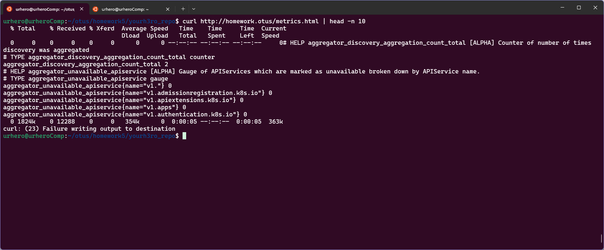

## ДЗ#5 Настройка сервисных аккаунтов и ограничение прав для них  

### Задания:
- В namespace homework создать service account monitoring и дать ему доступ к endpoint'у /metrics вашего кластера
- Изменить манифест deployment из прошлых ДЗ так, чтобы поды запускались под service account monitoring
- В namespace homework создать service account с именем cd и дать ему роль admin в рамках namespace homework
- Создать kubeconfig для service account cd
- Сгенерировать для service account cd токен с временем действия 1 день и сохранить его в файл token
#### Задание с *:
- Модифицировать deployment из прошлых ДЗ так, чтобы в процессе запуска pod происходило обращение к endpoint'у /metrics вашего кластера (механика вызова не принципиальна), результат ответа сохранялся в файл metrics.html и содержимое этого файла можно было бы получить при обращении по адресу /metrics.html вашего сервиса
### Подготовка
1. Необходимо убедиться, что на ноде есть label `homework=true`, это можно посмотреть командой `kubectl get nodes --show-labels`. В моем случае, label уже есть на нужной ноде. Если label нет, его необходимо создать командой `kubectl label nodes <node-name> homework=true`  
2. Если, как у меня, нет dns-сервера, необходимо добавить запись в `/etc/hosts`, `127.0.0.1 homework.otus`
```sh
echo "127.0.0.1 homework.otus" | sudo tee -a /etc/hosts
```

### Запуск 
1. Создать namespace командой `kubectl apply -f kubernetes-security/namespase.yaml`
2. Создать остальные ресурсы командой `kubectl apply -f kubernetes-security/`

### Описание решения
1. Файлы `configmap-nginx-config.yaml`, `deployment.yaml`, `namespace.yaml`,`cm.yaml`,`ingress.yaml`,`storageClass.yaml` наследованы из прошлого ДЗ 
2. Файл `metrics-rbac.yaml` создает service account `monitoring` и выдает права на просмотр метрик кластера. В одном файле описаны несколько ресурсов для удобства
```yaml
apiVersion: v1
kind: ServiceAccount
metadata:
  name: monitoring
  namespace: homework
---
apiVersion: rbac.authorization.k8s.io/v1
kind: ClusterRole
metadata:
  name: monitoring-get
rules:
  - nonResourceURLs:
      - "/metrics"
    verbs:
      - get
---
apiVersion: rbac.authorization.k8s.io/v1
kind: ClusterRoleBinding
metadata:
  name: monitoring-get-rb
subjects:
  - kind: ServiceAccount
    name: monitoring
    namespace: homework
roleRef:
  kind: ClusterRole
  name: monitoring-get
  apiGroup: rbac.authorization.k8s.io
```
3. Файл `admin-rbac.yaml` создает sercie account с именем cd и присваивает ему права admin в рамках namespace homework
```yaml
apiVersion: v1
kind: ServiceAccount
metadata:
  name: cd
  namespace: homework
---
apiVersion: rbac.authorization.k8s.io/v1
kind: Role
metadata:
  name: admin
  namespace: homework
rules:
- apiGroups: [""]
  resources: ["*"]
  verbs: ["*"]
---
apiVersion: rbac.authorization.k8s.io/v1
kind: RoleBinding
metadata:
  name: admin-rb
subjects:
- kind: ServiceAccount
  name: cd
  namespace: homework
roleRef:
  kind: Role
  name: admin
  apiGroup: rbac.authorization.k8s.io
```
4. Внесены изменения в файл `deployment.yaml`. 
  - Добавлено `serviceAccountName: monitoring` что бы pods запускались от service account monitoring. 
  - Так же сделан еще один initContainer `fetch-metrics` который с помощью curl считывает токен и забирает метрики и кладет в файл `metrics.html`  
```yaml
...
    spec:
      serviceAccountName: monitoring
...
        - name: fetch-metrics
          image: curlimages/curl:8.8.0
          volumeMounts:
            - name: pvc-nginx
              mountPath: /init
          command: ["/bin/sh", "-c"]
          args:
            - >
              TOKEN=$(cat /var/run/secrets/kubernetes.io/serviceaccount/token) &&
              curl -k -H "Authorization: Bearer $TOKEN" -o /init/metrics.html https://kubernetes.docker.internal:6443/metrics ||
              echo 'Failed to fetch metrics' > /init/metrics.html
```

Запросить метрики можно командой:
```sh 
curl http://homework.otus/metrics.html 
```


5. В файле `token` лежит token сгенерированный командой 
```sh
kubectl create token cd --namespace=homework --duration=24h
```
6. `cd.kubeconfig` это файл с конфигом kubeconfig для kubectl
