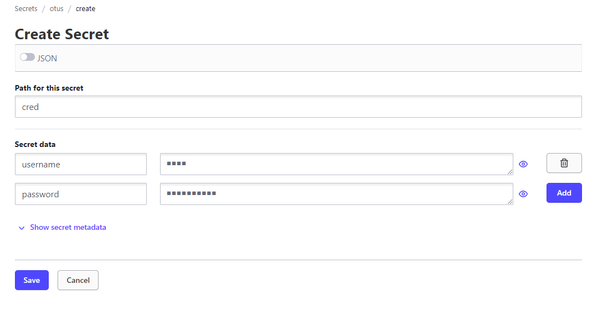
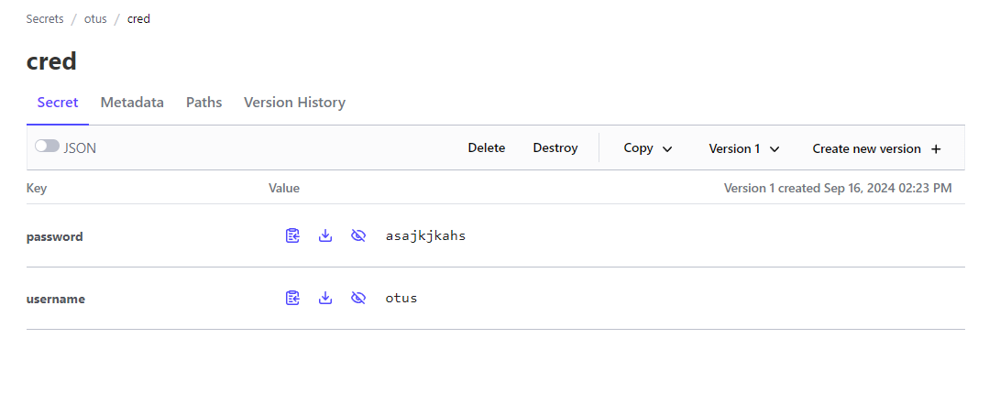

## ДЗ#11 Хранилище секретов для приложения. Vault.

### Задания:  
- Данное задание будет выполняться в managed k8s в Yandex cloud
- Разверните managed Kubernetes cluster в Yandex cloud любым удобным вам способом. Создайте 3 ноды для кластера
- В namespace consul установите consul из helm-чарта https://github.com/hashicorp/consul-k8s.git с параметрами 3 реплики для сервера. Приложите команду установки чарта и файл с переменными к результатам ДЗ.
- В namespace vault установите hashicorp vault из helm-чарта https://github.com/hashicorp/vault-helm.git
  - Сконфигурируйте установку для использования ранее установленного consul в HA режиме
  - Приложите команду установки чарта и файл с переменными к результатам ДЗ.
- Выполните инициализацию vault и распечатайте с помощью полученного unseal key все поды хранилища
- Создайте хранилище секретов otus/ с Secret Engine KV, а в нем секрет otus/cred, содержащий username='otus' password='asajkjkahs’
- В namespace vault создайте serviceAccount с именем vault-auth и ClusterRoleBinding для него с ролью system:auth-delegator. Приложите получившиеся манифесты к результатам ДЗ
- В Vault включите авторизацию auth/kubernetes и сконфигурируйте ее используя токен и сертификат ранее созданного ServiceAccount
- Создайте и примените политику otus-policy для секретов /otus/cred с capabilities = [“read”, “list”]. Файл .hcl с политикой приложите к результатам ДЗ
- Создайте роль auth/kubernetes/role/otus в vault с использованием ServiceAccount vault-auth из namespace Vault и политикой otus-policy
- Установите External Secrets Operator из helm-чарта в namespace vault. Команду установки чарта и файл с переменными, если вы их используете приложите к результатам ДЗ
- Создайте и примените манифест crd объекта SecretStore в namespace vault, сконфигурированный для доступа к KV секретам Vault с использованием ранее созданной роли otus и сервис аккаунта vault-auth. Убедитесь, что созданный SecretStore успешно подключился к vault. Получившийся манифест приложите к результатам ДЗ.
- Создайте и примените манифест crd объекта ExternalSecret с следующими параметрами:
  - ns – vault
  - SecretStore – созданный на прошлом шаге
  - Target.name = otus-cred
  - Получает значения KV секрета /otus/cred из vault и отображает их в два ключа – username и password соответственно
- Убедитесь, что после применения ExternalSecret будет создан Secret в ns vault с именем otus-cred и хранящий в себе 2 ключа username и password, со значениями, которые были сохранены ранее в vault. Добавьте манифест объекта ExternalSecret к результатам ДЗ.

### Запуск 
- Создать в yc необходимые ресурсы согласно описанию (Я это сделал в прошлом ДЗ)
- helm install --createnamespace --namespace consul consul consul
- helm install --createnamespace --namespace vault vault vault
- helm install --namespace vault external-secrets external-secrets

### Описание решения
Для разворачивания consul я использовал репозитории hashicrop, установил количество реплик values.yaml:
```yaml
# consul
server:
  replicas: 3
```
Для vault аналогично, вкелючил ha режим и установил storage consul:
```yaml
...
  ha:
    enabled: true
    config: |
      ui = true

...
      storage "consul" {
        path = "vault"
        address = "consul-consul-server.consul.svc.cluster.local:8500"
      }
```
Далее многие команды будут выполняться внутри пода vault:
```sh
kubectl exec --namespace vault -ti vault-2 -- vault operator init
```
Эта команда отдаст ключи и root токен необходымые для распечатывания контейнеров:
```sh
Unseal Key 1: S2p18bRj8ZIBnuPvk+RCcWiunboTjkkbO****
Unseal Key 2: 8FQA90iN9KVpQMKiyDNwhIhNUVwd/0y/6****
Unseal Key 3: KS+ItQn+hJR2s/iH1b9yhqyX4nFFXyzvWF****
Unseal Key 4: AigrSESb7Mvv58JqLhmOAhdumDLTacNJq****
Unseal Key 5: amUvB9+nXop4Kv4ggSFFi4tZhKwMNpuxs****

Initial Root Token: hvs.m793pcUPXb****
```
Далее с помощью команд и ключей unseal нужно распечатать все поды:
нужно следить за Seal Progress ввыводе и вводить ключи столько раз сколько потребуется
```sh
kubectl exec --namespace vault -ti vault-* -- vault operator unseal
# enter Unseal Key
kubectl exec --namespace vault -ti vault-* -- vault operator unseal
# enter Unseal Key
kubectl exec --namespace vault -ti vault-* -- vault operator unseal
# enter Unseal Key
...
```
```
Создайте хранилище секретов otus/ с Secret Engine KV, а в нем секрет otus/cred, содержащий username='otus' password='asajkjkahs’
```
Я сделал это через web-ui:  



Далее в файле vault-auth-sa.yaml создал serviceAccount с именем vault-auth и ClusterRoleBinding для него с ролью system:auth-delegator 
Далее внутри pod vault-0 включил и настроил kubernetes авторизацию:
```sh
# kubectl exec --namespace vault -ti vault-0 -- sh
vault auth enable kubernetes
vault write auth/kubernetes/config \
token_reviewer_jwt="$(cat /var/run/secrets/kubernetes.io/serviceaccount/token)" \
kubernetes_host="https://$KUBERNETES_PORT_443_TCP_ADDR:443" \
kubernetes_ca_cert=@/var/run/secrets/kubernetes.io/serviceaccount/ca.crt
```
Далее прописал политику для otus/cred и настроил роль:
```sh
# kubectl exec --namespace vault -ti vault-0 -- sh
vault policy write otus-policy - <<EOF
path "otus/*" {
  capabilities = ["read", "list"]
}
EOF
vault write auth/kubernetes/role/otus \
bound_service_account_names=vault-auth \
bound_service_account_namespaces=vault \
policies=otus-policy \
ttl=72h
```
Установил helm chart external-secrets:
```sh
helm repo add external-secrets https://charts.external-secrets.io

helm install --namespace vault external-secrets external-secrets
```

и создал SecretStore и ExternalSecret в external-secret.yaml
```sh
kubectl apply -f external-secret.yaml

kubectl get --all-namespaces externalsecrets.external-secrets.io -o wide
NAMESPACE   NAME   STORE   REFRESH INTERVAL   STATUS         READY
vault       otus   otus    1h                 SecretSynced   True
```