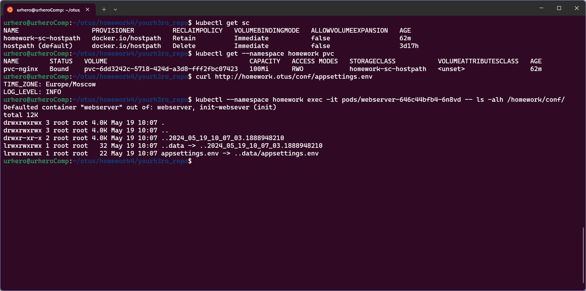
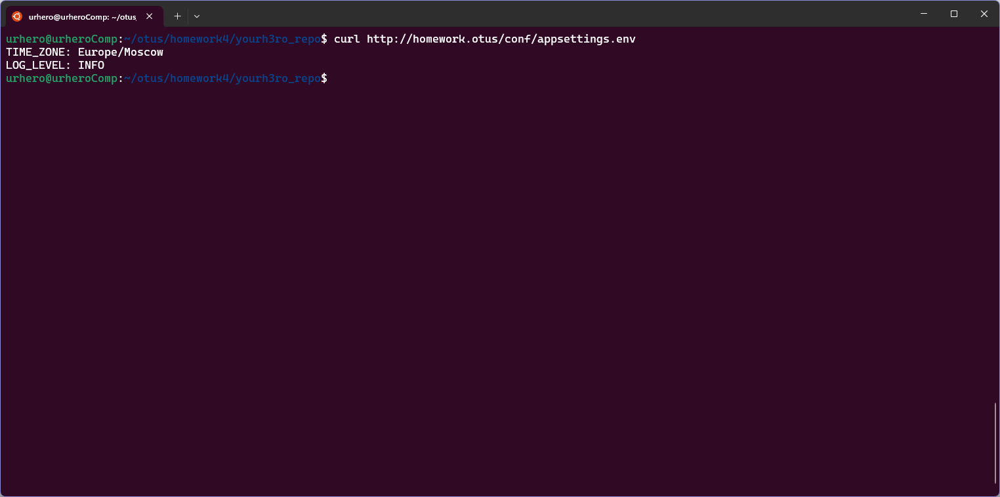

## ДЗ#4 Volumes, StorageClass, PV, PVC 

### Задания:

#### Задание с *

### Подготовка
1. Необходимо убедиться, что на ноде есть label `homework=true`, это можно посмотреть командой `kubectl get nodes --show-labels`. В моем случае, label уже есть на нужной ноде. Если label нет, его необходимо создать командой `kubectl label nodes <node-name> homework=true`  
2. Если, как у меня, нет dns-сервера, необходимо добавить запись в `/etc/hosts`, `127.0.0.1 homework.otus`
```sh
echo "127.0.0.1 homework.otus" | sudo tee -a /etc/hosts
```

### Запуск 
1. Создать namespace командой `kubectl apply -f kubernetes-volumes/namespase.yaml`
2. Создать остальные ресурсы командой `kubectl apply -f kubernetes-volumes/`

### Описание решения
1. Файлы `configmap-nginx-config.yaml`, `deployment.yaml`, `namespace.yaml` наследованы из прошлого ДЗ 
2. Файл `storageClass.yaml` создает storage class, полностью повторяющий "стандартный", за исключением `ReclaimPolicy: Retain`  
```yaml
apiVersion: storage.k8s.io/v1
kind: StorageClass
metadata:
  name: homework-sc-hostpath
provisioner: docker.io/hostpath
reclaimPolicy: Retain
volumeBindingMode: Immediate
```
3. Файл `pvc.yaml` создает `PersistentVolumeClaim`, который запрашивает 100Mi из storage class `homework-sc-hostpath` (из п.2)  
4. Файл `cm.yaml` конфигурирует ConfigMap с конфигурацией вымышленного приложения в файле `appsettings.env`. Для примера, я задаю приложению уровень логирования и часовой пояс.   
```yaml
apiVersion: v1
kind: ConfigMap
metadata:
  name: app-configmap
  namespace: homework
data:
  appsettings.env: |
    TIME_ZONE: Europe/Moscow
    LOG_LEVEL: INFO
```
5. В `deployment.yaml` внесены изменения:  
- Добавлен `volume` `pvc-nginx` и смонтирован в InitContainer и в nginx container:
```yaml
      initContainers:
        - name: init-websever
        ...
          volumeMounts:
            - name: pvc-nginx
              mountPath: /init

      containers:
        - name: webserver
          image: nginx:1.26.0-bookworm
          ...
          volumeMounts:
            - name: pvc-nginx
              mountPath: /homework/


      volumes:
        - name: pvc-nginx
          persistentVolumeClaim:
            claimName: pvc-nginx
```
- Добавлен `volume` `configmap` `app-configmap`, который монитирует configmap из п.4
```yaml
      containers:
        - name: webserver
          image: nginx:1.26.0-bookworm
          ports:
            - containerPort: 8000
              name: webserver-port
          volumeMounts:
            - name: app-configmap
              mountPath: /homework/conf/
              readOnly: true
            ...
      volumes:
        ...
        - name: app-configmap
          configMap:
            name: app-configmap
```

### Проверка
Для проверки созданных StorageClass можно воспользоваться командой 
```sh
kubectl get storageclasses
```
storage class это бъект уровня кластера, следовательно namespace не указывается  

Для проверки PersistentVolumeClaims:
```sh
kubectl get --namespace homework persistentvolumeclaims
```
Для проверки того, что configMap находится внутри pod в каталоге /homework/conf можно посмотреть это внутри пода командой ls 
```sh
kubectl --namespace homework exec -it pods/webserver-646c44bfb4-6n8vd -- ls -alh /homework/conf/
```


Так же проверка через `curl http://homework.otus/conf/appsettings.env` должна возвращать content из файла `appsettings.env`:

